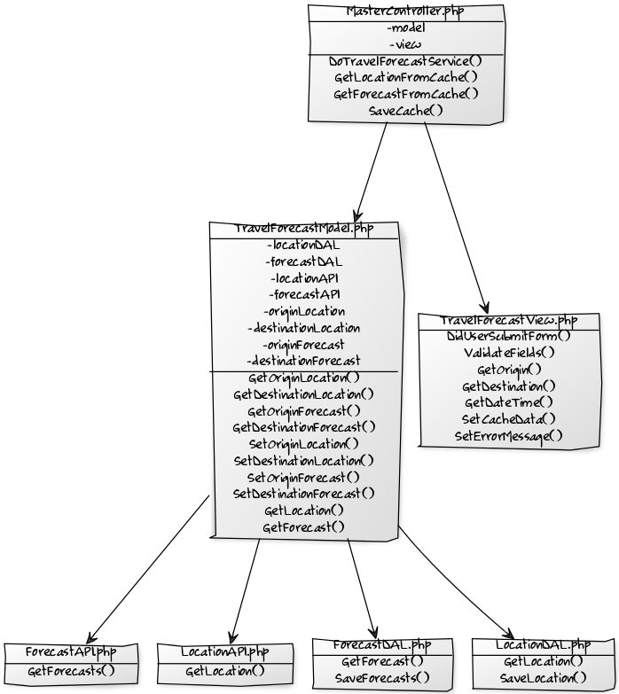

# Väder jämförelse
- <b>Sing Trinh</b> (dt222cc - WP14)
http://46.101.229.31/1dv449project/
- [Publicerad körbar applikation](http://46.101.229.31/1dv449project/)
- [Demonstration](https://github.com/dt222cc/1DV449_dt222cc/tree/master/Project/raw/demo.md)
- [Kurshemsida](https://coursepress.lnu.se/kurs/webbteknik-ii/projektbeskrivning/)

#Inledning
Jag hade först planerat att skapa ett reseplanerare med väder prognoser, för till och från platserna. Det visade sig att det skulle ta mer tid än vad jag hade. Resultatet blev då ett väderprognos jämnförare, typ eller vad man nu ska kalla det. Användaren matar in två platser och tidfället. Prognoser för de två platserna under angivet tidfälle presenteras för användaren. Jag har inte precis hunnit kolla upp om det finns liknander applikationer, finns förmodligen det.

De tekniker som jag använde och stötte på under projektets gång var då:
- PHP och JavaScript som programmerings språk (Mest PHP)
- jQuery: AJAX och lite DOM.
- MySQL för persistent förvaring av sökresultat (platser och prognoser).
- Cache: HTML5 Local Storage.

Api:er
- Api Geonames: Hämta koordinater efter namn (plats name).
- Api OpenWeatherMap: Hämta prognoser efter koordinater.

#Design/Schema
#### Service/MasterController

***

#### Index och Views

#Cache lösning
Jag kör emot local storage om webbläsaren har stöd för det och en mysql databas med två tabeller. Det fungerar så att om webbläsaren har stöd för local storage och det finns sparade resultat där så kollar applikationen av om platsen/plateserna eller om prognosen finns där i cachen. Om det finns så körs ingenting emot databas eller API. Om det inte finns så görs ett kontroll i databasen och om den inte finns där så hämtar vi resultat från API, sedan sparas nya resultat i databas och cachen. Det finns optimeringar att göra för cachningen, stoppa in flera platser (kanske i bakgrunden, eller om användaren "vill" göra det så kan en knapp läggas till).

Exempel av flöde:
<pre>
- Plats1 = cache? ja, fortsätt
- Plats2 = cache? nej > databas? ja, fortsätt
- Prognos1 = cache? nej > databas? nej > webservice? ja, fortsätt
- Prognos2 = cache? nej > databas? nej > webservice? nej, exception > felmeddelande, slut
</pre>

<pre>
- Plats1 = cache? ja, fortsätt
- Plats2 = cache? nej > databas? ja, fortsätt
- Prognos1 = cache? nej > databas? ja, fortsätt
- Prognos2 = cache? nej > databas? nej > webservice? ja > spara till databas, fortsätt
- Spara till cache (enbart nya resultat, som plats2 och prognos1/2).
</pre>

#Säkerhet och prestandaoptimering
Jag validerar indata från användaren. För databas så såg jag till att jag för skyddad mot sql-incetion. Jag har inte precis validerat data från de två api:er, jag hade inte precis koll på hur jag skulle få ihop det + ont om tid. Använder inte cookies, så jag skippar den säkerhetsdelen. Ej någon form av inloggning, så ej OAuth. Är kanske öppen mot CSRF attacker. För prestanda så har vi cachning, CSS där uppe, JavaScript där nere. Valde att inte minifiera js, tycker inte att det var värt det för just denna projekt. Hade inte så mycket javascript.

#Offline-first
Jag saknar implementation av offline, jag hann inte med det. Applikationen skulle kunna fungera i offline i teori, det handlar om att man skulle kunna göra sökningar på platser som man hade tidigare hade gjort, om webbläsaren har stöd för local storage då och att informationen är kvar.

#Risker
Ingen validering av data från de olika api:er. Ej någon typ av SSL-certifikat, vilket gör att jag inte kan köra min applikation över https. Det kanske finns en risk för överbelastning, har inte precis koll på hur jag kollar det. Det kan bli en väldig många request mot api om användaren gör flera olika anrop mot olika dagar och platser hela tiden då jag tar emot alla prognoser för den valda dagen. Skulle kanske vara en bättre ide att ta flera prognoser över flera dagar, isåfall skulle det kanske ta med tid vid varje "ny" förfrågan.

#Reflektioner
Jag började med den andra projektet i 1dv409. När jag började med denna projekt så märkte jag av tidigt att jag behövde tänka om omfattningen (minus trafik delen). Sedan så stötte jag på problem angående cachning. Tänkte först köra med fil cachning vid servern men läste att det fungerar inte så bra för min typ av cachning, json och dynamisk uppdatering av cachen (lägga till nya sökresultat). Sedan så tog det tid att klura ut hur jag skulle koordinera mellan klientets local storage med PHP, där jag har databas och webbapi hantering. Strul med webbhotellet. Jag hann ju inte med offline delen, "kanske" fortsätta med den delen om jag måste men skulle helst inte vilja göra det :) Jag skulle ha velat att pyssla med designen mer, göra den mer responsiv, som du/ni ser så har jag faktist inte lagt ned någon tid åt css, liksom det fungerar.

#Extra
Tid för kommentering skulle ha kunnats lägga på implementation av offline istället. Tycker dock att kommentering är skönt att ha, samlar mina tankar bättre. Tycker att kod kvalitén är ok, man har förmodligen inte några större svårigheter med att förstå hur appliaktionen fungerar.