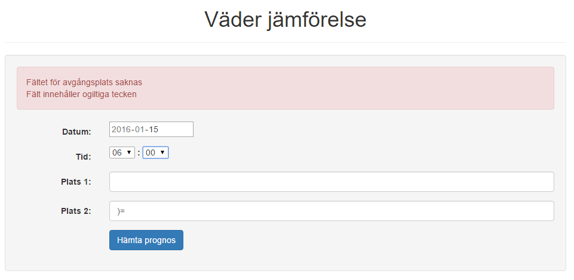

<pre>
Tyckte att applikationen inte behövde en demonstations film.
</pre>
***
Jag heter Sing Trinh och detta är applikationen som jag hann utveckla.

Det blev en applikation som hämtar väder prognoser för två olika platser vid en specifik tidfälle, applikationen skulle egentligen fungera som ett tillägg åt en reseplanerare men det löste sig inte.
***
När man först laddar sidan ser man ett formulär där man väljer tid, datum och skriver in två platser.

<pre>
Datum och tid är förvalt till dagens datum och aktuell tid,
dessa fälter formateras sedan för att passa med API:et OpenWeatherMap

De två text fälterna har validering, tomma fälter och ej speciella tecken.

Datum och tid måste vara nu eller upp till fem dagar frammåt,
då OpenWeatherMap's API ej visar utdaterade prognoser.

Dock om man har gjort en "giltig" sökning tidigare och att
den finns kvar i cachen eller i databasen, så kan man få fram prognosen.
</pre>
***
En lyckad resultat kan se ut så här:

<pre>
Notera att den angivna tiden konverteras till tre timmars prognos i samband med
formatteringen.

Det finns mycket att förbättra, angående design och prognosernas omfattning,
t.o.m cache lösningen.
</pre>
***
Om en sökning lyckades inte att hämta plats eller prognos från respektiv API, så ska det presenteras lite röd text för användaren. Dock så visas detta inte i den publicerade version till skillnad från den lokala versionen.

