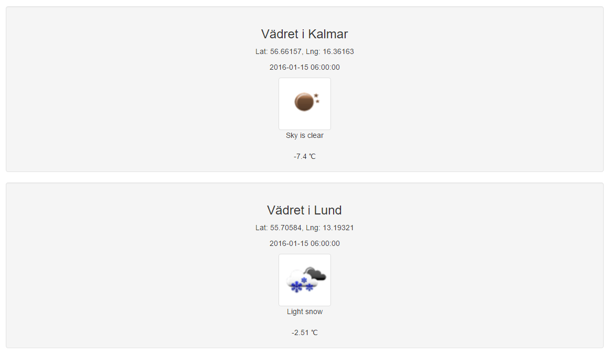

# Demonstration

- [Video](raw/1dv449project-dt222cc.mp4)

***
Jag heter Sing Trinh och detta är applikationen som jag hann utveckla.

Det blev en applikation som hämtar väder prognoser för två olika platser vid en specifik tidfälle, applikationen skulle egentligen fungera som ett tillägg åt en reseplanerare men det löste sig inte.
***
När man först laddar sidan ser man ett formulär där man väljer tid, datum och skriver in två platser.

<pre>
Datum och tid är förvalt till dagens datum och aktuell tid, dessa fälter formateras sedan för att passa
med API:et OpenWeatherMap

Datum och tid måste vara mellan dagens datum och fem dagar frammåt, pga OpenWeatherMap's begränsningar.

De två text fälterna har validering, tomma fälter och ej speciella tecken.
</pre>

***
En lyckad resultat kan se ut så här:

<pre>
Notera att den angivna tiden konverteras till tre timmars prognos i samband med formatteringen.
</pre>

***
Om en sökning lyckades inte att hämta plats eller prognos från respektiv API, så ska det presenteras lite röd text för användaren.

